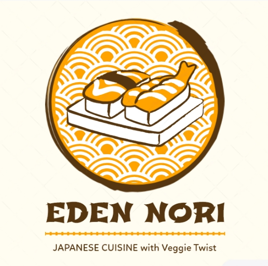

x# 🍣 EdenNori - Asian Cloud Kitchen



**Premium Asian Vegetarian Cuisine | Cloud Kitchen | Raipur, India**

EdenNori is a modern, tech-enabled cloud kitchen delivering authentic Asian vegetarian cuisine across Raipur, Chhattisgarh. Our mission is to bring the vibrant flavors of Japanese, Chinese, Thai, and Indo-Asian fusion food directly to your doorstep.

## 🌟 Features

### 🍜 **Diverse Menu Categories**
- **Japanese** - Traditional sushi, ramen, teriyaki bowls (25+ dishes)
- **Indo-Asian** - Fusion of Indian & Asian flavors (20+ dishes) 
- **Chinese** - Authentic vegetarian Chinese cuisine (18+ dishes)
- **Thai** - Aromatic curries & stir-fries (15+ dishes)

### 🥗 **100% Pure Vegetarian**
- FSSAI Certified kitchen
- Fresh, ethically sourced ingredients
- No compromise on authentic flavors
- Wholesome and nutritious meals

### 🔥 **Signature Dishes**
- **Dragon Veggie Roll** - Fresh avocado, cucumber, carrot with spicy mayo
- **Quantum Veggie Ramen** - 48-hour slow-cooked vegetable broth 
- **Neo Tokyo Tofu Bowl** - Grilled smoked tofu with teriyaki sauce
- **Fusion Burst Paneer Bao** - Indian-Japanese fusion with molecular elements

### 💫 **Modern Features**
- **Search & Filter** - Find dishes by name, category, or ingredients
- **Real-time Menu** - Live kitchen updates and availability
- **Customer Reviews** - Authentic feedback from 2,500+ happy customers
- **Responsive Design** - Optimized for all devices

## 🛠️ Tech Stack

- **Framework**: Next.js 15.3.5 (React 19)
- **Styling**: Tailwind CSS 3.4.17
- **UI Components**: Radix UI + shadcn/ui
- **Icons**: Lucide React
- **Animations**: Framer Motion-like effects
- **TypeScript**: Full type safety
- **Package Manager**: pnpm

## 📱 Pages & Components

### **Core Pages**
- `/` - Homepage with hero, menu showcase, and testimonials
- `/menu` - Complete menu with search and filtering
- `/about` - Our story and cloud kitchen philosophy
- `/contact` - Get in touch and location info
- `/checkout` - Order placement and payment

### **Key Components**
- `DarkHero` - Dynamic homepage hero section
- `MenuShowcase` - Interactive menu browser with search
- `CustomerStories` - Real customer testimonials
- `NeonMenuCategories` - Glowing category navigation
- `DynamicFoodShowcase` - Animated dish displays
- `GlowingSpecials` - Featured combo meals
- `FloatingStats` - Live kitchen statistics

## 🚀 Getting Started

### Prerequisites
- Node.js 18+ 
- pnpm (recommended) or npm

### Installation

1. **Clone the repository**
```bash
git clone https://github.com/NamanOG/EdenNori.git
cd EdenNori
```

2. **Install dependencies**
```bash
pnpm install
# or
npm install
```

3. **Run development server**
```bash
pnpm dev
# or
npm run dev
```

4. **Open in browser**
```
http://localhost:3000
```

### Build for Production

```bash
pnpm build
pnpm start
```

## 🎨 Design System

### **Color Palette**
- **Primary**: Purple to Pink gradients (`from-purple-500 to-pink-500`)
- **Secondary**: Cyan to Blue (`from-cyan-400 to-blue-400`) 
- **Accent**: Orange to Red (`from-orange-500 to-red-500`)
- **Success**: Green tones (`from-green-400 to-emerald-400`)

### **Typography**
- **Primary**: Inter (system font)
- **Japanese**: Noto Sans JP (for authentic feel)
- **Serif**: Georgia (for elegant headings)

### **Dark Theme**
- Background: Black to gray gradients
- Cards: Semi-transparent dark (`bg-gray-900/50`)
- Text: White with gray variations
- Borders: Subtle gray with color accents

## 📊 Performance Features

- **Optimized Images** - Next.js Image optimization
- **Code Splitting** - Automatic page-based splitting
- **Search Optimization** - Efficient filtering algorithms
- **Mobile First** - Responsive design principles
- **Fast Loading** - Optimized bundle sizes

## 🍽️ Menu Highlights

### **Popular Items**
| Dish | Category | Price | Rating |
|------|----------|-------|--------|
| Dragon Veggie Roll | Sushi | ₹450 | 4.8⭐ |
| Vegetable Tonkotsu Ramen | Ramen | ₹420 | 4.9⭐ |
| Paneer Yakitori | Grilled | ₹390 | 4.8⭐ |
| Tofu Poke Bowl | Rice Bowls | ₹450 | 4.7⭐ |

### **Chef's Specials**
- **Chef's Tasting Platter** - ₹899 (serves 2-3)
- **Family Fusion Feast** - ₹1299 (serves 4-5)

## 📈 Statistics

- 🎯 **2,500+** Happy Customers
- ⭐ **4.6/5** Average Rating  
- 🍽️ **18+** Signature Dishes
- 🏙️ **3** Cities Served (Mumbai, Pune, Delhi planned)

## 🌱 Sustainability

- **100% Vegetarian** - Ethical and sustainable
- **Local Sourcing** - Supporting local farmers
- **Minimal Waste** - Optimized portioning
- **Eco Packaging** - Biodegradable containers

## 🤝 Contributing

We welcome contributions! Please feel free to submit a Pull Request.

1. Fork the repository
2. Create your feature branch (`git checkout -b feature/AmazingFeature`)
3. Commit your changes (`git commit -m 'Add some AmazingFeature'`)
4. Push to the branch (`git push origin feature/AmazingFeature`)
5. Open a Pull Request

## 📞 Contact

- **Location**: Raipur, Chhattisgarh 492001
- **Phone**: +91 XXXXX XXXXX
- **Email**: hello@edennori.com
- **Website**: [edennori.com](https://edennori.com)

## 📄 License

This project is proprietary software. All rights reserved.

---

**EdenNori** - *Where Cloud Kitchen Innovation Meets Authentic Asian Flavors* 🌈

Made with ❤️ in Raipur, India
